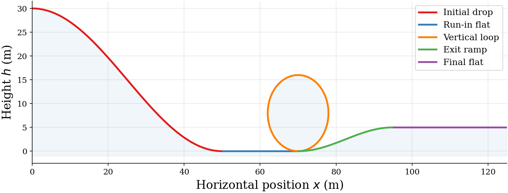
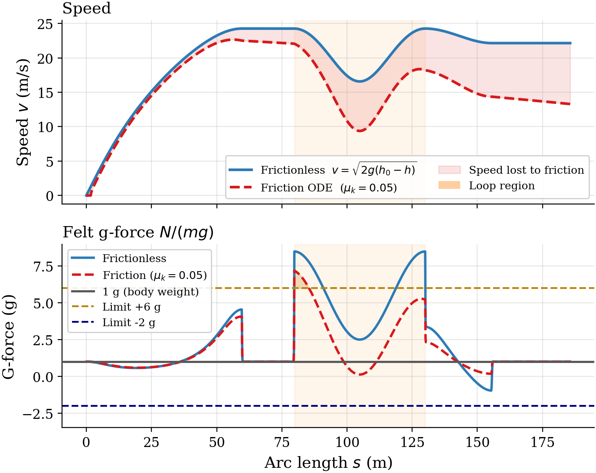
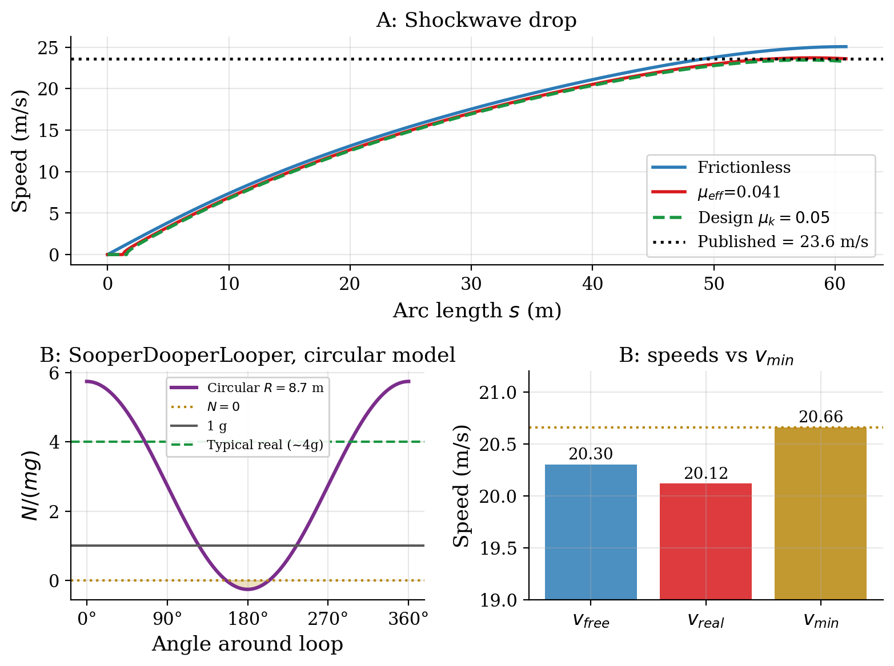

# Rollercoaster Loop Dynamics in Python

Can a rollercoaster safely complete a vertical loop, and can a simple mathematical model tell us?

This project builds a chain of physical models for a rollercoaster (track geometry, speed with and without friction, and the forces on the rider) and tests them against published data from three real rides. The friction model holds up well. The textbook circular-loop model does not, and the way it fails explains why real loops are teardrop-shaped.

**[Read the full analysis, with code and all figures →](rollercoaster_dynamics.ipynb)**

## Key findings

- **Friction barely affects top speed but costs 40% of the exit speed.** Adding friction lowers the peak speed by only 7% (24.3 to 22.7 m/s), because little distance has been travelled by the bottom of the first drop. By the end of the track, 40% of the exit speed has been lost.
- **The loop is where most energy is lost.** Per metre, the loop dissipates about three times as much energy as the flat sections, because its curvature increases the normal force and friction grows with it.
- **The standard safety criterion is optimistic.** The textbook condition for completing a circular loop, an entry speed of at least √(5gR), rates this loop as safe with an 11% margin. It assumes no friction inside the loop, though. Including that friction cuts the force holding riders to the track at the top from 1.20g to 0.12g, leaving almost no margin.
- **A circular loop is also too harsh at the bottom.** Entering a constant-radius loop at full speed produces 7.2g at its base, above the 6g short-duration limit.
- **The friction model matches a real ride.** For Shockwave at Drayton Manor, the model predicts the speed at the bottom of the 32 m drop to within 1.4% of the published 53 mph, using a friction value chosen before looking at the ride.
- **The circular-loop model fails on a real ride.** For SooperDooperLooper at Hersheypark, the circular model requires an entry speed of 20.7 m/s. That is more than the ride's published speed (20.1 m/s) and even more than its frictionless maximum (20.3 m/s). The model says a loop that has run safely since 1977 cannot be completed.
- **Real loops are not circles.** The loop on the Great American Revolution, the first modern looping coaster, is 90 ft tall but only 45 ft wide. Real loops are broad at the base and tight at the top (the *clothoid* or teardrop shape), which fixes both failures of the circular model at once.

## Selected figures

**The modelled track.** A drop, a vertical loop and an exit hill, described parametrically so the track can loop back on itself.



**Speed and felt g-force along the track.** The shaded gap in the top panel is speed lost to friction. The bottom panel shows the g-force jumping past the 6g limit at the loop entrance.



**Testing against real rides.** Top: the friction model reproduces Shockwave's drop speed. Bottom: for SooperDooperLooper's loop, the circular model predicts the car loses contact at the top (shaded) and requires more speed than the ride can reach.



## Approach

| Model | Method |
|:--|:--|
| Track geometry | Parametric curve with arc length as the independent variable, plus signed curvature |
| Frictionless speed | Energy conservation, solved analytically |
| Speed with friction | ODE along the track, solved numerically with SciPy's `solve_ivp` (RK45) |
| G-force | Normal force from track slope, curvature and speed |
| Loop safety | Analytical normal force around a circular loop and the √(5gR) criterion |

The analysis also includes:

- **Sensitivity analysis:** sweeps of the friction coefficient and the drop height.
- **Numerical check:** the energy budget closes to within 0.001%, confirming the ODE solution is accurate.
- **Critical friction:** a root-finder solves for the friction level at which the loop would fail.
- **Fitted friction:** a root-finder fits the friction coefficient to published ride data.

## Running the notebook

```bash
pip install -r requirements.txt
jupyter notebook rollercoaster_dynamics.ipynb
```

Run all cells from the top. The figures are saved to `figures/`. No data files are needed, because the ride figures (heights, speeds, loop sizes and g-ratings) are published values entered directly in the notebook.

## Limitations

- The model is two-dimensional, so it has no banking or lateral forces.
- Rolling, bearing and air resistance are combined into one effective friction coefficient.
- The circular loop joins straight track with no transition curve.
- The validation uses published ride statistics rather than measured speed profiles.

## Repository contents

| File | Contents |
|:--|:--|
| `rollercoaster_dynamics.ipynb` | Full analysis: code, commentary and outputs |
| `figures/` | Figures generated by the notebook |
| `requirements.txt` | Python packages needed to run it |
